# Installation et Configuration d'un Active Directory

**Auteur :** Thibaut HUET

---

## 1. Introduction

Vous venez d'être recruté comme technicien système et réseau dans une PME appelée **TechnoLab**. L'entreprise souhaite centraliser l'administration de ses utilisateurs et postes informatiques grâce à un serveur Active Directory.

### Objectif
Créer un Active Directory fonctionnel.

### Ressources utilisées
- **VMware Workstation Player** (hyperviseur)
- **ISO Windows Server** (pour le serveur)
- **ISO Windows 10/11** (pour le PC client test)

### Déroulement
1. Installer un serveur Windows Server
2. Mettre en place un domaine Active Directory
3. Créer les comptes utilisateurs
4. Intégrer un poste client Windows au domaine
5. Tester le fonctionnement global
6. Rédiger un rapport technique détaillé

---

## 2. Installation de l'environnement virtuel

### Installation de l'hyperviseur
Le choix s'est porté sur **VMware Workstation Player** (ou VirtualBox). L'installation s'est déroulée de manière standard.

### Création des Machines Virtuelles (VM)

Deux machines virtuelles distinctes ont été créées :

| Paramètre | VM Serveur (SRV-AD) | VM Client (CLIENT01) |
|---|---|---|
| Système d'exploitation | Windows Server 2022 | Windows 10/11 |
| Mémoire vive (RAM) | 4 Go | 2 à 4 Go |
| Processeur (CPU) | 2 vCPU | 1 ou 2 vCPU |
| Espace disque | 20 Go | 20 Go ou plus |
| Type de réseau | NAT ou Host-Only | Identique au serveur |

---

## 3. Installation de Windows Server

### Étapes
1. Amorcer la machine **SRV-AD** sur l'ISO Windows Server 2022
2. Sélectionner la version : **Windows Server 2022 Standard (Desktop Experience)** — pour disposer de l'interface graphique
3. Partitionner le disque virtuel de 20 Go et exécuter l'assistant d'installation
4. Définir le mot de passe du compte Administrateur local au premier démarrage :
   - **Mot de passe :** `Serveur2022`

---

## 4. Configuration réseau

### Renommage du serveur
1. Accéder au **Gestionnaire de serveur > Serveur local**
2. Cliquer sur **"Nom de l'ordinateur"**
3. Modifier la valeur par **SRV-AD**
4. Redémarrer la machine

### Adressage IP Fixe et DNS
Un contrôleur de domaine doit avoir une IP statique.

| Paramètre | Valeur |
|---|---|
| Adresse IP | 192.168.10.10 |
| Masque de sous-réseau | 255.255.255.0 |
| Passerelle par défaut | 192.168.10.1 |
| DNS préféré | 192.168.10.10 (boucle locale) |

### Test de validation
Exécuter `ipconfig /all` dans l'invite de commandes pour vérifier la configuration.

---

## 5. Installation de l'Active Directory

### Ajout du rôle AD DS
1. **Gestionnaire de serveur > Ajouter des rôles et fonctionnalités**
2. Sélectionner une installation basée sur un rôle
3. Cocher **Services de domaine Active Directory (AD DS)**
4. Valider l'ajout des fonctionnalités requises
5. Lancer l'installation

### Promotion du serveur et création du domaine
Une fois le rôle installé, cliquer sur la notification pour promouvoir le serveur :

- **Option de déploiement :** Ajouter une nouvelle forêt
- **Nom de domaine racine :** `technolab.local`
- **Niveau fonctionnel :** Windows Server 2016 (ou supérieur)
- **DSRM :** Définir un mot de passe de restauration sécurisé

Le serveur redémarre automatiquement.

---

## 6. Gestion des utilisateurs et groupes

### Création des Unités Organisationnelles (OU)
Depuis la console **Utilisateurs et ordinateurs Active Directory** :

- `Direction`
- `Comptabilite`
- `Informatique`
- `Utilisateurs`
- `Postes`

### Comptes Utilisateurs et Groupes Globaux

| Nom complet | Login | Mot de passe initial | Groupe associé |
|---|---|---|---|
| Alice Martin | amartin | P@ssw0rd123 | G_Direction |
| Hugo Bernard | hbernard | P@ssw0rd123 | G_Compta |
| Sarah Leroy | sleroy | P@ssw0rd123 | G_IT |

---

## 7. Intégration du client au domaine

### Paramétrage réseau du client
La machine CLIENT01 doit être sur le même réseau que le serveur.

| Paramètre | Valeur |
|---|---|
| Adresse IP | 192.168.10.20 |
| Masque | 255.255.255.0 |
| DNS | 192.168.10.10 |

Tester avec : `ping 192.168.10.10`

### Procédure de jonction au domaine
1. Ouvrir les **Propriétés système** de la machine cliente
2. Cliquer sur **Modifier** → renommer le PC en **CLIENT01**
3. Cocher la case **Domaine** → renseigner `technolab.local`
4. Saisir les identifiants : `TECHNOLAB\Administrateur`
5. Un message de bienvenue confirme la jonction → **Redémarrer**

### Test d'authentification utilisateur
Au redémarrage, utiliser **"Autre utilisateur"** et se connecter avec :
- `TECHNOLAB\amartin`
- Mot de passe : `Azerty01*` (après changement depuis l'AD)

### Vérifications
```cmd
whoami
nslookup technolab.local
net view
```

Le poste est visible dans l'Active Directory.

---

## 8. Recommandations

- Toujours utiliser une **IP fixe** sur le serveur
- Ne jamais utiliser un **DNS externe** sur un contrôleur de domaine
- **Sauvegarder** régulièrement le serveur
- Utiliser des **mots de passe complexes**
- Créer des **OU** pour organiser les objets

---

## 9. Difficultés rencontrées et résolution

| Problème | Solution |
|---|---|
| Impossible de changer le mot de passe via l'AD | Je n'étais pas connecté avec la session liée au domaine mais avec la session locale créée lors de l'installation de Windows |

---

## 10. Conclusion

### Qu'avez-vous appris ?
Ce TP a permis de comprendre de manière concrète le fonctionnement d'une architecture client-serveur en entreprise : manipulation d'un hyperviseur, réseau virtuel, paramétrage IP/DNS.

### Avantages d'un Active Directory
- **Centralisation :** Un seul point d'administration pour gérer les accès et l'authentification
- **Sécurité :** Politiques de mots de passe globalisées, gestion des privilèges par groupes
- **Évolutivité :** Ajout facile de nouveaux collaborateurs

---

## 11. Annexes — Commandes utiles

| Commande | Description |
|---|---|
| `ipconfig /all` | Affiche toute la configuration réseau |
| `ping [adresse_IP]` | Teste la connectivité réseau |
| `nslookup technolab.local` | Interroge le DNS pour résoudre le nom de domaine |
| `whoami` | Retourne l'identité de la session active |
| `net view` | Affiche les ressources partagées sur le domaine |

---

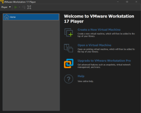
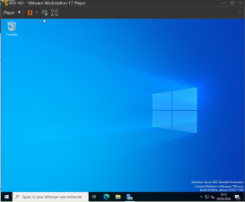

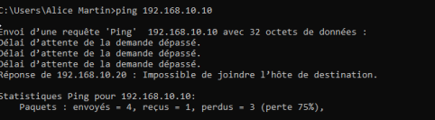
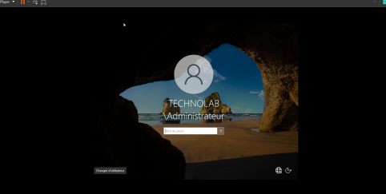
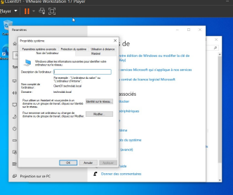
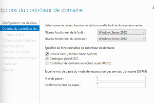

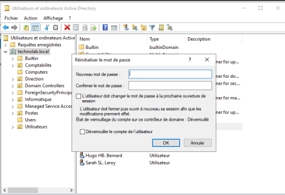
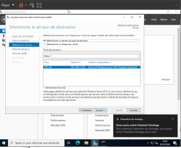
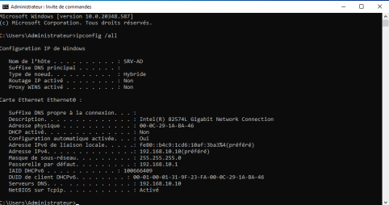
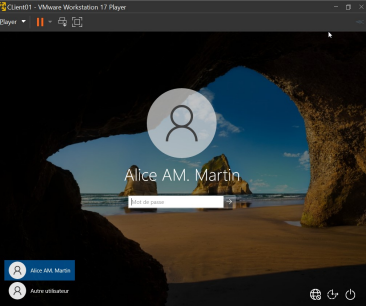
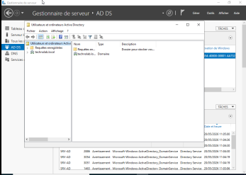
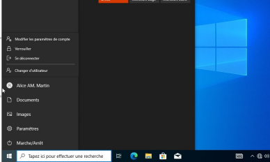
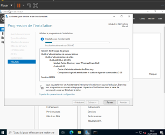
