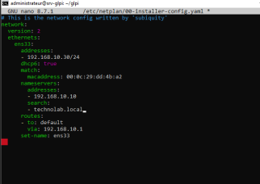
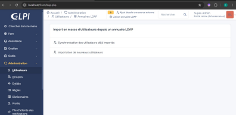
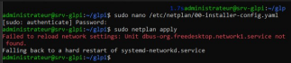
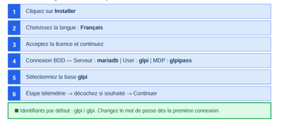
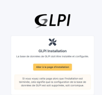
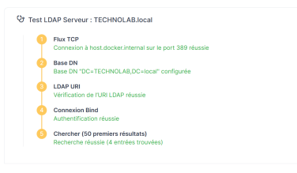
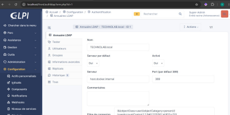
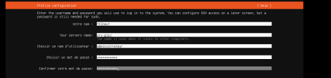
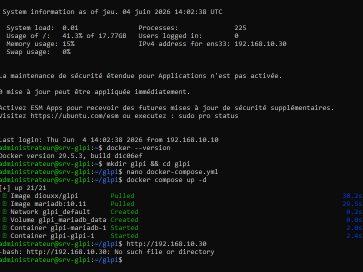
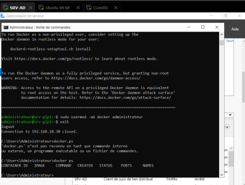

# Installation de GLPI avec Docker sur un serveur Linux

---

## 1. Installation de la VM Linux (Ubuntu Server)

### Création de la VM
- Utiliser l'ISO : `ubuntu-26.04-live-server-amd64` (ou version équivalente)
- Configuration réseau lors de l'installation :

1. Sélectionner la carte réseau `ens33` avec les flèches et appuyer sur **Entrée**
2. Choisir **Edit IPv4**
3. Passer de `Automatic (DHCP)` à **Manual**
4. Remplir les champs selon le plan d'adressage :

| Champ | Valeur |
|---|---|
| Subnet | `192.168.10.0/24` |
| Address | `192.168.10.30` |
| Gateway | `192.168.10.1` |
| Name servers | `192.168.10.10,8.8.8.8` |

> **Note :** Le premier DNS (192.168.10.10) est l'IP du contrôleur de domaine Active Directory.

### Vérification du partitionnement
Lors de l'étape **FILES SYSTEM SUMMARY**, vérifier que l'espace alloué est bien complet :

- Si la ligne indique `[ / 10.000G new ext4 nouveau LVM logical volume ]`
- Aller sur **ubuntu-lv** > Edit > changer pour la valeur maximale (ex: 18.222G pour une VM de 20Go)

### Profils de configuration
- **Identifiant :** `administrateur`
- **Mot de passe :** `Serveur2022` (attention : utiliser la touche **Lock Maj** et non Shift)

### Finalisation
1. Terminer l'installation et redémarrer
2. Au message `Please remove the installation medium, then press ENTER` → appuyer sur **Entrée**
3. Se connecter avec : `administrateur` / `Serveur2022`

---

## 2. Installation de Docker

Depuis le serveur Windows, se connecter en SSH :

```bash
ssh administrateur@192.168.10.30
# Taper "yes" puis le mot de passe
```

### Étapes d'installation

```bash
# 1. Mise à jour des dépôts
sudo apt update && sudo apt upgrade -y

# 2. Installation des prérequis
sudo apt install -y ca-certificates curl gnupg

# 3. Ajout de la clé GPG officielle de Docker
sudo install -m 0755 -d /etc/apt/keyrings
curl -fsSL https://download.docker.com/linux/ubuntu/gpg | sudo gpg --dearmor -o /etc/apt/keyrings/docker.gpg
sudo chmod a+r /etc/apt/keyrings/docker.gpg

# 4. Ajout du dépôt Docker
echo \
  "deb [arch=$(dpkg --print-architecture) signed-by=/etc/apt/keyrings/docker.gpg] https://download.docker.com/linux/ubuntu \
  $(. /etc/os-release && echo "$VERSION_CODENAME") stable" | \
  sudo tee /etc/apt/sources.list.d/docker.list > /dev/null

# 5. Installation de Docker et Docker Compose
sudo apt update
sudo apt install -y docker-ce docker-ce-cli containerd.io docker-buildx-plugin docker-compose-plugin

# 6. Éviter de taper sudo devant chaque commande Docker
sudo usermod -aG docker administrateur
```

### Vérification
Se **déconnecter** puis **reconnecter**, puis tester :

```bash
docker ps
```

---

## 3. Création de GLPI avec Docker Compose

### Structure du projet
```bash
mkdir glpi && cd glpi
nano docker-compose.yml
```

### docker-compose.yml
```yaml
services:
  mariadb:
    image: mariadb:10.11
    environment:
      MYSQL_ROOT_PASSWORD: rootpass
      MYSQL_DATABASE: glpi
      MYSQL_USER: glpi
      MYSQL_PASSWORD: glpipass
    volumes:
      - mariadb_data:/var/lib/mysql

  glpi:
    image: diouxx/glpi
    ports:
      - "80:80"
    environment:
      MYSQL_HOST: mariadb
      MYSQL_DATABASE: glpi
      MYSQL_USER: glpi
      MYSQL_PASSWORD: glpipass
    depends_on:
      - mariadb

volumes:
  mariadb_data:
```

### Lancement
```bash
docker compose up -d
```

### Vérification
Depuis le navigateur du serveur Windows : [http://192.168.10.30](http://192.168.10.30)

---

## 4. Liaison GLPI et Active Directory

### Configuration du LDAP dans GLPI
1. Se connecter à GLPI : `glpi` / `glpi`
2. Aller dans **Configuration > Authentification > Annuaires LDAP > Ajouter**

| Champ | Valeur |
|---|---|
| Nom | `TECHNOLAB.local` |
| Serveur par défaut | Oui |
| Activé | Oui |
| Serveur | `192.168.10.10` |
| Port | `389` |
| BaseDN | `DC=TECHNOLAB,DC=local` |
| DN du compte | `CN=Administrateur,CN=Users,DC=TECHNOLAB,DC=local` |
| Mot de passe | `Serveur2022` |
| Champ identifiant | `samaccountname` |

### Test de connexion
Utiliser le menu latéral dans la page LDAP.

### Import des utilisateurs AD dans GLPI
1. Aller dans **Administration > Utilisateurs**
2. Cliquer sur **"Liaison annuaire LDAP"** (si absent, redémarrer GLPI)
3. Cliquer sur **"Importer de nouveaux utilisateurs"**
4. Activer le **mode simplifié**, rechercher les utilisateurs
5. Sélectionner les utilisateurs en bas et cliquer sur **Importer** (bouton Actions)

### Test avec un PC client
Se rendre sur `http://192.168.10.30` depuis un client :
- **Identifiant :** `amartin`
- **Mot de passe :** `Azerty01*`

---

## 5. Problèmes rencontrés et résolutions

| Problème | Solution |
|---|---|
| Impossible de se connecter à GLPI | Redémarrer Docker puis le conteneur : `sudo systemctl restart docker && cd glpi && docker compose up -d` |
| `ping technolab.local` ne répond pas | Vérifier la configuration Netplan (voir ci-dessous) |

### Configuration réseau pour lier le serveur Linux à l'AD

```bash
sudo nano /etc/netplan/00-installer-config.yaml
```

Exemple de configuration :

```yaml
network:
  ethernets:
    ens33:
      addresses:
        - 192.168.10.30/24
      nameservers:
        addresses:
          - 192.168.10.10
      routes:
        - to: default
          via: 192.168.10.1
  version: 2
```

Appliquer la configuration :

```bash
sudo netplan apply
sudo systemctl restart systemd-resolved
ping technolab.local
```

### Intégration complète du serveur Linux à l'AD

Installer les outils nécessaires :

```bash
sudo apt update && sudo apt install -y realmd sssd sssd-tools libnss-sss libpam-sss adcli samba-common-bin packagekit
```

Découvrir et rejoindre le domaine :

```bash
sudo realm discover technolab.local
sudo realm join --user=Administrateur technolab.local
```

Vérification :

```bash
id Administrateur@technolab.local
```

---

## 6. Création d'un ticket GLPI (exemple)
1. Se connecter avec un utilisateur du domaine
2. Aller dans **Assistance > Tickets > Nouveau ticket**
3. Remplir le titre et la description
4. Assigner à un technicien si nécessaire

---












