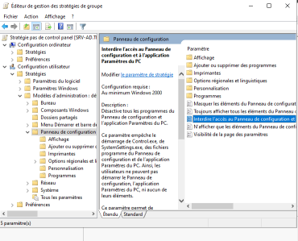
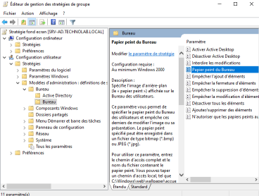
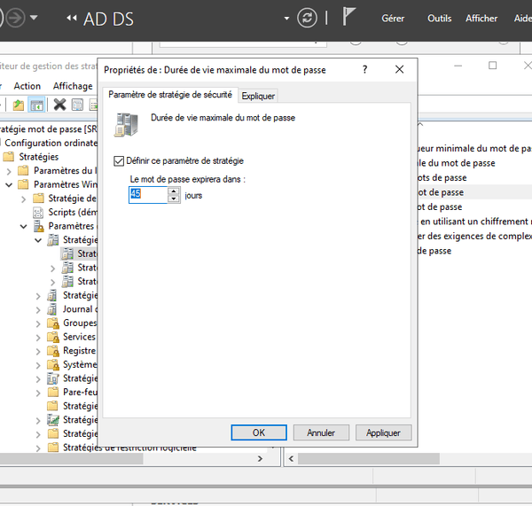
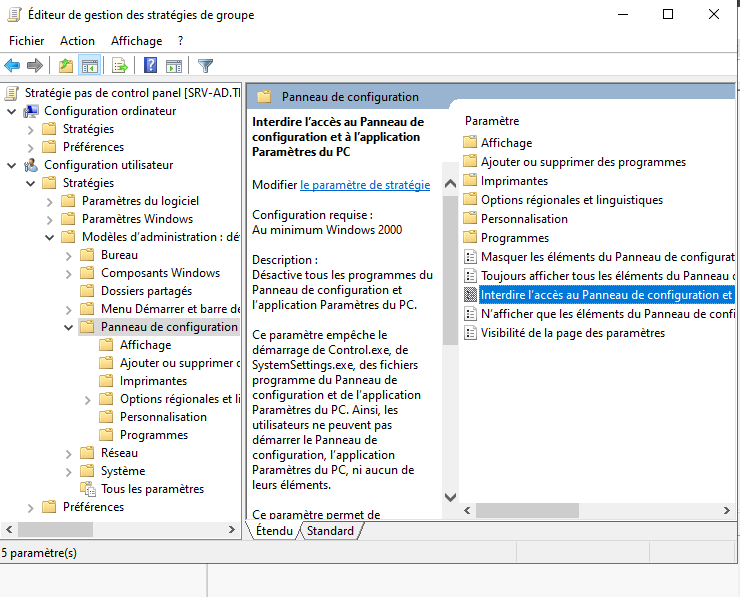

# Mise en place de GPO (Group Policy Objects)

**Auteur :** Thibaut HUET  
**Date :** Juin 2026  
**Contexte :** Projet AP BTS SIO — Infrastructure GSB  
**Domaine :** `technolab.local`

---

## Table des matières

1. [Création des utilisateurs et des groupes](#1-création-des-utilisateurs-et-des-groupes)
2. [GPO — Politique de mots de passe](#2-gpo--politique-de-mots-de-passe)
3. [GPO — Restrictions par service](#3-gpo--restrictions-par-service)
4. [GPO — Arrière-plans personnalisés](#4-gpo--arrière-plans-personnalisés)
5. [Application et validation des GPO](#5-application-et-validation-des-gpo)
6. [Problèmes rencontrés et solutions](#6-problèmes-rencontrés-et-solutions)
7. [Conclusion](#7-conclusion)

---

## 1. Création des utilisateurs et des groupes

### Création des groupes de sécurité

Depuis la console **Utilisateurs et ordinateurs Active Directory** :

1. Clic droit sur le domaine `technolab.local`
2. **Nouveau** → **Groupe**
3. Créer 3 groupes de sécurité de type **Globale** :

| Groupe | Description |
|---|---|
| `G_Direction` | Personnel de direction |
| `G_Compta` | Service comptable |
| `G_IT` | Service informatique |



### Création des utilisateurs

Clic droit sur le domaine → **Nouveau** → **Utilisateur**

| Nom | Prénom | Login | Mot de passe | Groupe |
|---|---|---|---|---|
| Deuf | John | `jdeuf` | `Azerty01*` | G_Compta |
| Patatra | Joshua | `jpatatra` | `Azerty01*` | G_Compta |
| Genemotip | Faim | `fgenemotip` | `Azerty01*` | G_Compta |
| Bidet | Loic | `lbidet` | `Azerty01*` | G_Direction |
| Sebastian | Patrick | `psebastian` | `Azerty01*` | G_Direction |
| Delariviera | Xavier | `xdelariviera` | `Azerty01*` | G_Direction |
| Efairemal | Fahim | `fefairemal` | `Azerty01*` | G_IT |
| Cocoriquo | Gerare | `gcocoriquo` | `Azerty01*` | G_IT |
| Rico | Gepeto | `grico` | `Azerty01*` | G_IT |
| Goujon | Homme | `hgoujon` | `Azerty01*` | G_IT |


### Attribution des utilisateurs aux groupes

1. Cliquer sur le groupe concerné
2. Aller dans l'onglet **Membres**
3. Cliquer sur **Ajouter** et sélectionner les utilisateurs correspondants

---

## 2. GPO — Politique de mots de passe

### Création de la GPO

1. Ouvrir **Outils** → **Gestion de stratégie de groupe** (`gpmc.msc`)
2. Clic droit sur le domaine `technolab.local` → **Créer un objet GPO dans ce domaine**

> **Attention :** Une GPO appliquée sur le domaine s'applique à **tous les utilisateurs**.

3. Nommer la GPO : `Politique-MotsDePasse`



### Configuration de la politique

1. Clic droit sur la GPO → **Modifier**
2. Naviguer jusqu'à : `Configuration ordinateur` → `Stratégies` → `Paramètres Windows` → `Paramètres de sécurité` → `Stratégies de comptes` → `Stratégie de mot de passe`

### Paramètres appliqués

| Paramètre | Valeur |
|---|---|
| Longueur minimale du mot de passe | **12 caractères** |
| Durée de vie maximale du mot de passe | **45 jours** |
| Historique du mot de passe | 10 mémorisés |
| Complexité activée | Oui |

### Application immédiate

Pour que les utilisateurs changent leur mot de passe à la prochaine connexion :

1. Aller dans **Utilisateurs et ordinateurs Active Directory**
2. Sélectionner les utilisateurs concernés
3. Clic droit → **Propriétés** → **Compte**
4. Cocher **Utilisateur doit changer le mot de passe à la prochaine ouverture de session**

---

## 3. GPO — Restrictions par service

### Création des GPO par OU

Au lieu d'appliquer sur le domaine, **lier la GPO à l'OU spécifique** pour cibler uniquement le service concerné.

### Service Comptabilité — Blocage de cmd.exe

| Paramètre | Valeur |
|---|---|
| OU cible | `Comptabilite` |
| GPO | `Restriction-Compta` |
| Restriction | Interdire l'accès à l'invite de commandes |

**Configuration :**

1. Créer une nouvelle GPO nommée `Restriction-Compta`
2. **Modifier** → `Configuration utilisateur` → `Stratégies` → `Modèles d'administration` → `Système`
3. Activer **Empêcher l'accès à l'invite de commandes**
4. **Lier la GPO** à l'OU `Comptabilite` (pas au domaine !)



### Service Informatique — Droits d'administration

Les membres du service informatique doivent avoir des droits d'administration sur les postes du domaine.

**Méthode :** Ajouter le groupe `G_IT` au groupe **Administrateurs du domaine** (`Domain Admins`).

1. Ouvrir **Utilisateurs et ordinateurs Active Directory**
2. Aller dans le dossier **Users**
3. Double-cliquer sur le groupe **Administrateurs du domaine** (`Domain Admins`)
4. Onglet **Membres** → **Ajouter** → sélectionner `G_IT`

### Service Direction — Blocage du Panneau de configuration

| Paramètre | Valeur |
|---|---|
| OU cible | `Direction` |
| GPO | `Restriction-Direction` |
| Restriction | Interdire l'accès au Panneau de configuration |

**Configuration :**

1. Créer une nouvelle GPO nommée `Restriction-Direction`
2. **Modifier** → `Configuration utilisateur` → `Stratégies` → `Modèles d'administration` → `Panneau de configuration`
3. Activer **Interdire l'accès au Panneau de configuration**
4. **Lier la GPO** à l'OU `Direction`

---

## 4. GPO — Arrière-plans personnalisés

### Préparation des ressources

Les fonds d'écran doivent être placés sur un **dossier partagé** accessible en lecture par les utilisateurs.

1. Créer un partage réseau sur le serveur ou le NAS
2. Déposer les images de fond d'écran (format `.jpg` ou `.bmp`)
3. Configurer les ACL en lecture pour les groupes concernés

### Création de la GPO

1. Créer une GPO nommée `ArrierePlan-Services`
2. **Modifier** → `Configuration utilisateur` → `Stratégies` → `Modèles d'administration` → `Bureau` → `Active Desktop / Bureau`
3. Activer **Papier peint du bureau**
4. Définir le chemin du fichier image : `\\serveur\partage\fond_ecran.jpg`
5. Définir le style : **Ajuster** ou **Remplir**

> **Variante par groupe :** Créer une GPO distincte par service avec un fond d'écran différent pour chaque groupe (G_Compta, G_Direction, G_IT).

---

## 5. Application et validation des GPO

### Forcer l'application des GPO

Sur le serveur ou les postes clients, exécuter :

```batch
gpupdate /force
```

### Vérification des GPO appliquées

```batch
gpresult /r
```

Cette commande affiche l'ensemble des GPO appliquées à l'utilisateur et à l'ordinateur, ainsi que leur ordre de priorité.



### Ordre de priorité

Les GPO sont appliquées dans l'ordre suivant (la dernière appliquée remporte en cas de conflit) :

1. GPO locales (L')
2. GPO liées au site
3. GPO liées au domaine
4. GPO liées à l'OU (les plus spécifiques)

---

## 6. Problèmes rencontrés et solutions

### Problème : Les fonds d'écran ne s'affichent pas

**Problème :** Les images de fond d'écran ne s'appliquent pas sur les postes clients.

**Solution :** Vérifier que les images sont stockées sur un **dossier partagé accessible** en lecture par les utilisateurs du domaine, et que le chemin UNC est correctement renseigné dans la GPO.

---

## 7. Conclusion

La mise en place des GPO sur le domaine `technolab.local` permet une **gestion centralisée** et **granulaire** des paramètres de sécurité et de configuration des postes clients. Chaque service dispose de restrictions adaptées à son rôle :

| Service | Restriction | Privilège |
|---|---|---|
| Comptabilité | Pas d'invite de commandes | Utilisateur standard |
| Direction | Pas de panneau de configuration | Utilisateur standard |
| Informatique | Aucune restriction | Administrateur du domaine |

### Bénéfices

- **Sécurité renforcée** grâce à la politique de mots de passe
- **Productivité** optimisée par des restrictions adaptées
- **Personnalisation** via les fonds d'écran par service
- **Gestion centralisée** depuis un seul point d'administration
