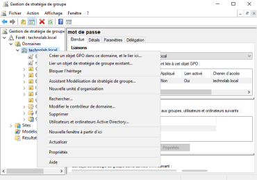

# Mise en place de GPO (Group Policy Objects)

---

## 1. Création des utilisateurs et des groupes

### Création des groupes
Depuis la console **Utilisateurs et ordinateurs Active Directory** :

1. Clique droit sur le domaine
2. **Nouveau > Groupe**
3. Créer 3 groupes de sécurité (type : **Globale**) :

| Groupe |
|---|
| G_Direction |
| G_Compta |
| G_IT |

### Création des utilisateurs
Clique droit sur le domaine > **Nouveau > Utilisateur**

| Nom | Prénom | Login | Mot de passe | Groupe |
|---|---|---|---|---|
| Deuf | John | jdeuf | Azerty01* | G_COMPTA |
| Patatra | Joshua | jpatatra | Azerty01* | G_COMPTA |
| Génémotip | Faim | fgenemotip | Azerty01* | G_COMPTA |
| Bidet | Loic | lbidet | Azerty01* | G_DIRECTION |
| Sebastian | Patrick | psebastian | Azerty01* | G_DIRECTION |
| Delariviera | Xavier | xdelariviera | Azerty01* | G_DIRECTION |
| efairemal | Fahim | fefairemal | Azerty01* | G_IT |
| COCORIQUO | Gérare | gcocoriquo | Azerty01* | G_IT |
| Rico | Gépéto | grico | Azerty01* | G_IT |
| GOUJON | Homme | hgoujon | Azerty01* | G_IT |

### Attribution des utilisateurs aux groupes
1. Cliquer sur le groupe
2. Aller dans l'onglet **Membres**
3. Ajouter les utilisateurs correspondants

---

## 2. GPO de sécurité — Politique de mots de passe

1. Ouvrir **Outils > Gestion de stratégie de groupe**
2. Clique droit sur le domaine > **Créer un objet GPO dans ce domaine**

> **Attention :** Une GPO appliquée sur le domaine s'applique à **tous les utilisateurs**.

3. Nommer la GPO (ex: `Politique-MotsDePasse`)
4. Clique droit > **Modifier**
5. Naviguer vers :

```
Configuration ordinateur > Stratégies > Paramètres Windows > Paramètres de sécurité > Stratégies de comptes > Stratégie de mot de passe
```

### Paramètres à configurer

| Paramètre | Valeur |
|---|---|
| Longueur minimale du mot de passe | **12 caractères** |
| Durée de vie maximale du mot de passe | **45 jours** |

6. Pour forcer le changement au prochain logon : le faire depuis chaque compte dans **Utilisateurs et ordinateurs Active Directory** (cocher "Utilisateur doit changer son mot de passe à la prochaine ouverture de session")

---

## 3. Droits et restrictions par service

### Restrictions applicatives

| Service | Droits |
|---|---|
| **Compta** | Pas d'accès à l'invite de commandes (`cmd.exe`) |
| **IT** | Accès complet (tout autorisé) |
| **Direction** | Panneau de configuration (**Control Panel** non autorisé) |

### Application par OU
Pour appliquer une GPO à un service spécifique uniquement :
1. Clique droit sur **l'OU** (et non sur le domaine)
2. **Créer un objet GPO dans ce domaine**
3. Suivre la même procédure de modification

### Exemple : Restreindre l'invite de commandes pour la compta

```
Configuration utilisateur > Stratégies > Modèles d'administration > Système
> Empêcher l'accès à l'invite de commandes → Activé
```

### Exemple : Restreindre le panneau de configuration pour la direction

```
Configuration utilisateur > Stratégies > Modèles d'administration > Panneau de configuration
> Interdire l'accès au Panneau de configuration → Activé
```

### Droits d'administration pour le service IT
1. Aller dans **Utilisateurs et ordinateurs Active Directory**
2. Dossier **Users** > double-clic sur **Administrateurs du domaine (Domain Admins)**
3. Onglet **Membres** > **Ajouter** > sélectionner le groupe **G_IT**

---

## 4. Attribution d'arrière-plans différents par groupe

Pour appliquer un fond d'écran personnalisé par groupe (Direction, Compta, IT) :

1. Placer les images de fond d'écran sur un **dossier partagé** accessible en lecture par tous les utilisateurs
2. Créer une GPO par groupe avec le paramètre :

```
Configuration utilisateur > Stratégies > Modèles d'administration > Bureau > Bureau actif
> Fond d'écran du bureau → Activé
```

3. Spécifier le chemin UNC du fichier image (ex: `\\serveur\partage\fond-direction.jpg`)
4. Lier chaque GPO à l'OU correspondante

---

## 5. Application et test des GPO

Pour forcer l'application immédiate des GPO sur le serveur ou un client :

```cmd
gpupdate /force
```

### Vérification
```cmd
gpresult /r
```

---

## 6. Problème rencontré : Fonds d'écran

**Problème :** Les fonds d'écran ne s'appliquent pas.

**Solution :** Les images doivent être placées sur un **dossier partagé** accessible en lecture par les utilisateurs concernés (partage SMB avec les droits NTFS appropriés).

---



