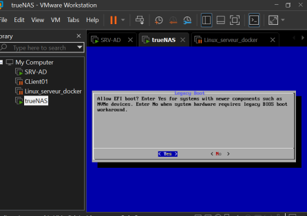
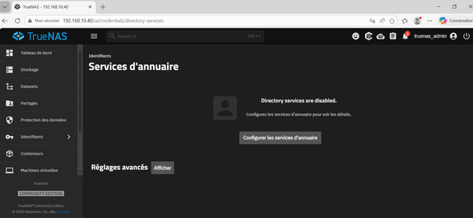

# Installation et Configuration de TrueNAS

**Auteur :** Thibaut HUET  
**Date :** Juin 2026  
**Contexte :** Projet AP BTS SIO — Infrastructure GSB  
**Domaine :** `technolab.local`

---

## Table des matières

1. [Prérequis](#1-prérequis)
2. [Création de la VM TrueNAS](#2-création-de-la-vm-truenas)
3. [Installation de TrueNAS](#3-installation-de-truenas)
4. [Configuration réseau](#4-configuration-réseau)
5. [Synchronisation NTP (Kerberos)](#5-synchronisation-ntp-kerberos)
6. [Création du pool de stockage ZFS](#6-création-du-pool-de-stockage-zfs)
7. [Enregistrement DNS sur le serveur AD](#7-enregistrement-dns-sur-le-serveur-ad)
8. [Jonction au domaine Active Directory](#8-jonction-au-domaine-active-directory)
9. [Création du partage SMB](#9-création-du-partage-smb)
10. [Configuration des ACL](#10-configuration-des-acl)
11. [Mappage automatique via GPO](#11-mappage-automatique-via-gpo)
12. [Tests et validation](#12-tests-et-validation)
13. [Problèmes rencontrés et solutions](#13-problèmes-rencontrés-et-solutions)
14. [Conclusion](#14-conclusion)

---

## 1. Prérequis

- **VMware Workstation Player** (ou autre hyperviseur)
- **ISO TrueNAS** (version Core ou Scale)
- **Espace disque :** 16 Go (système) + 50 Go (stockage)
- **Réseau :** NAT sur le même réseau que le domaine `technolab.local`

---

## 2. Création de la VM TrueNAS

### Configuration matérielle

| Paramètre | Valeur |
|---|---|
| Système d'exploitation | TrueNAS (Core / Scale) |
| Mémoire vive (RAM) | 4 Go minimum |
| Processeur (CPU) | 2 vCPU |
| Disque 1 (système) | 16 Go |
| Disque 2 (stockage) | 50 Go |
| Type de réseau | NAT |

### Procédure

1. Créer une VM avec **un disque de 16 Go** pour l'installation du système
2. Une fois la VM créée, **modifier ses paramètres**
3. **Ajouter un second disque de 50 Go** qui servira au stockage des données


---

## 3. Installation de TrueNAS

1. Démarrer la VM sur l'ISO TrueNAS
2. Sélectionner la langue et le clavier selon vos préférences
3. Choisir **Install/Upgrade** sur l'écran d'accueil
4. Sélectionner le disque de **16 Go** comme destination d'installation

### Compte administrateur

| Champ | Valeur |
|---|---|
| Identifiant | `truenas_admin` |
| Mot de passe | `Serveur@)@@` |

> **Note :** Le mot de passe `Serveur@)@@` correspond à `Serveur2022` saisi en azerty mais interprété en qwerty.

5. **EFI :** Yes
6. Terminer l'installation
7. **Reboot System**


---

## 4. Configuration réseau

### Depuis la console TrueNAS

#### Option 1 — Interface réseau

1. Aller dans **Option 1** → **Configure network interfaces**
2. Sélectionner `ens33` → **Entrée**
3. `ipv4_dhcp` : **No**
4. `aliases` : ajouter `192.168.10.40/24`
5. **Save** → appuyer sur **A** pour appliquer

#### Option 2 — Paramètres réseau

Aller dans **Option 2** → **Configure network settings**

| Paramètre | Valeur |
|---|---|
| Hostname | `truenas` |
| Domain | `TECHNOLAB.local` |
| IPv4 Gateway | `192.168.10.1` |
| Name Server 1 | `192.168.10.10` |


### Accès à l'interface web

Depuis le serveur Windows, ouvrir un navigateur et accéder à :

```
http://192.168.10.40
```


---

## 5. Synchronisation NTP (Kerberos)

Le protocole **Kerberos** (utilisé par Active Directory) exige que l'heure soit synchronisée à **moins de 5 minutes** entre TrueNAS et le contrôleur de domaine.

### Méthode 1 : Réglage manuel

Dans la console TrueNAS, option **8 (Linux Shell)** :

```bash
date -s "2026-06-05 10:26:00"
```

(Bien mettre l'heure actuelle du serveur AD)

### Méthode 2 : Synchronisation via NTP

Ajouter le serveur AD comme source NTP :

```bash
echo "server 192.168.10.10 iburst prefer" >> /etc/chrony.conf
systemctl restart chronyd
```


---

## 6. Création du pool de stockage ZFS

### Depuis l'interface web TrueNAS

1. Aller dans **Storage** → **Créer un volume**
2. Remplir les champs :

| Champ | Valeur |
|---|---|
| Nom du pool | `datapool` |
| Cocher **Allow** | Disques non-uniques (VMware) |
| Layout | **Stripe** (1 disque) |
| Disk Size | 50 GiB |
| Width | 1 |
| Number of VDEVs | 1 |

3. Cliquer sur **Créer le volume**
4. Confirmer l'opération


---

## 7. Enregistrement DNS sur le serveur AD

Pour que les clients du domaine puissent résoudre le nom `truenas.technolab.local`, il faut créer un enregistrement DNS.

1. Sur le serveur Windows, ouvrir le **Gestionnaire DNS** (Outils → DNS)
2. Dérouler le nom du serveur DNS
3. Cliquer sur **Zones de recherche directes** → `technolab.local`
4. Clic droit → **Nouvel hôte (A)**

| Champ | Valeur |
|---|---|
| Nom | `truenas` |
| Adresse IP | `192.168.10.40` |

5. Cliquer sur **Ajouter un hôte** (ignorer l'avertissement PTR)



---

## 8. Jonction au domaine Active Directory

### Depuis l'interface web TrueNAS

1. Aller dans **Identifiants** → **Services d'annuaire**
2. Cliquer sur **Configurer les services d'annuaire**

### Paramètres de jonction

| Champ | Valeur |
|---|---|
| Type de configuration | **Active Directory** |
| Activer le service | ✅ Coché |
| Type d'identifiant | **Kerberos User** |
| Nom d'utilisateur | `Administrateur` |
| Mot de passe | `Serveur2022` |
| Nom d'hôte TrueNAS | `truenas` |
| Nom de domaine | `technolab.local` |

3. Cliquer sur **Sauvegarder**
4. Attendre la jonction au domaine


---

## 9. Création du partage SMB

### Création du dataset

1. Aller dans **Storage** → cliquer sur `datapool`
2. Cliquer sur **Créer dataset**
3. Nom du dataset : `partage`

### Configuration du partage SMB

1. Aller dans **Partages** → **Partages Windows (SMB)** → **Ajouter**

| Champ | Valeur |
|---|---|
| Chemin | `/mnt/datapool/partage` |
| Nom du partage | `Partage` |
| Description | Partage commun technolab.local |
| Activé | ✅ Coché |

2. **Enregistrer**


---

## 10. Configuration des ACL

Après la création du partage, configurer les permissions d'accès via l'éditeur ACL :

1. Cliquer sur **Configurer les ACL**
2. Cliquer sur **+ Ajouter une entrée**

| Champ | Valeur |
|---|---|
| Qui | **Groupe** |
| Groupe | `DEVIDA\utilisateurs du domaine` |
| Type d'ACL | **Autoriser** |
| Autorisations | **Modifier** |
| Flags | **Hériter** |

3. **Sauvegarder ACL**


### Accès depuis Windows

```
\\192.168.10.40\Partage
ou
\\truenas\Partage
```

---

## 11. Mappage automatique via GPO

Pour que le lecteur réseau se monte **automatiquement** au moment de la connexion des utilisateurs, une GPO est créée sur le contrôleur de domaine.

### Création de la GPO

1. Sur le serveur AD : `Win+R` → `gpmc.msc` → **Entrée**
2. Clic droit sur `technolab.local` → **Créer un objet GPO**
3. Nom : `Lecteur-TrueNAS`
4. **OK**
5. Clic droit sur `Lecteur-TrueNAS` → **Modifier**

### Configuration du lecteur mappé

1. Naviguer : `Configuration utilisateur` → `Préférences` → `Paramètres Windows` → `Mappages de lecteurs`
2. Clic droit dans la zone → **Nouveau** → **Lecteur mappé**

| Champ | Valeur |
|---|---|
| Action | **Créer** (ou **Mettre à jour** — voir problèmes) |
| Emplacement | `\\192.168.10.40\Partage` |
| Reconnecter | ✅ Coché |
| Lettre de lecteur | `Z:` |
| Libellé | `Partage TrueNAS` |



### Application sur les postes clients

```batch
gpupdate /force
```

Le lecteur Z: apparaît automatiquement lors de la prochaine ouverture de session des utilisateurs.

---

## 12. Tests et validation

### Vérifications

- Accès au partage : `\\192.168.10.40\Partage`
- Lecteur Z: visible dans le poste client après connexion
- Création et modification de fichiers dans le partage
- Vérification dans l'Active Directory : le poste apparaît bien dans l'OU Postes

### Commandes utiles

```batch
net use              # Affiche les lecteurs mappés
net view \\truenas   # Liste les partages disponibles sur TrueNAS
gpresult /r          # Vérifie les GPO appliquées
ping truenas         # Test de résolution DNS
```

---

## 13. Problèmes rencontrés et solutions

### Problème 1 : Le lecteur n'apparaît pas dans les postes clients

**Problème :** La GPO de mappage de lecteur semble correcte mais le lecteur Z: n'apparaît pas sur les postes clients.

**Cause :** Par défaut, la GPO tente de monter le lecteur réseau avec le compte **SYSTEM** de la machine, et non avec la session de l'utilisateur. Le système n'a aucun droit sur TrueNAS, donc le mappage échoue silencieusement.

**Solution 1 :** Exécuter dans le contexte utilisateur

1. Clic droit sur le lecteur Z: dans la GPO → **Propriétés**
2. Aller dans l'onglet **Commun**
3. Cocher **Exécuter dans le contexte de sécurité de l'utilisateur connecté (option de stratégie utilisateur)**
4. **Appliquer** → **OK**

**Solution 2 :** Passer l'action en *Mettre à jour*

Si le lecteur Z: existe déjà suite à une tentative échouée, l'action *Créer* échoue.

1. Passer l'**Action** sur **Mettre à jour (Update)**
2. C'est plus robuste : crée le lecteur s'il n'existe pas, ou le met à jour s'il y a eu des modifications

**Solution 3 :** Redémarrer TrueNAS

```bash
# Depuis la console TrueNAS, option 8 (Shell)
systemctl restart midclt
# Ou simplement redémarrer la VM
```

### Problème 2 : Le NAS est visible mais inaccessible

**Problème :** Le partage TrueNAS est visible dans le réseau mais les utilisateurs ne peuvent pas y accéder.

**Solution :** Vérifier que le service **SMB** est bien actif dans l'interface web TrueNAS :

1. Aller dans **Partages** → **Partages Windows (SMB)**
2. Vérifier que le service est activé
3. Si nécessaire, redémarrer le service SMB

---

## 14. Conclusion

TrueNAS est désormais pleinement intégré à l'infrastructure TechnoLab :
- **Stockage centralisé** via un pool ZFS performant
- **Authentification AD** pour une gestion unifiée des accès
- **Partage SMB** accessible depuis tous les postes du domaine
- **Mappage automatique** du lecteur réseau via GPO

### Points clés

- ZFS offre une intégrité des données et des performances accrues
- L'intégration Kerberos nécessite une **synchronisation NTP** rigoureuse
- L'enregistrement **DNS** est indispensable pour la résolution de noms
- Les **GPO** permettent un déploiement transparent du lecteur réseau pour tous les utilisateurs
