# Procédure Technique — Installation et Configuration de TrueNAS

**Auteur :** Thibaut HUET  
**Date :** Juin 2026  
**Contexte :** Projet AP BTS SIO — Infrastructure GSB  
**Document :** Doc_AP_1 — Procédure Technique

---

## Présentation du projet

Ce document détaille la procédure technique d'installation et de configuration d'un serveur de stockage **TrueNAS** au sein de l'infrastructure **TechnoLab**. TrueNAS est intégré au domaine Windows Server Active Directory pour offrir un stockage centralisé et sécurisé à l'ensemble des utilisateurs.

### Plan d'adressage

| Équipement | Rôle | Adresse IP |
|---|---|---|
| SRV-AD | Contrôleur de domaine | `192.168.10.10` |
| TrueNAS | Serveur NAS | `192.168.10.40` |
| CLIENT01 | Poste client | `192.168.10.20` |

---

## 1. Création de la machine virtuelle

### Configuration matérielle

| Paramètre | Valeur |
|---|---|
| Hyperviseur | VMware Workstation Player |
| Système d'exploitation | TrueNAS Core / Scale |
| RAM | 4 Go |
| CPU | 2 vCPU |
| Disque système | 16 Go (Virtuel) |
| Disque de stockage | 50 Go (Virtuel) |
| Réseau | NAT (192.168.10.0/24) |

### Procédure

1. Créer la VM avec un disque de 16 Go
2. Modifier les paramètres de la VM pour ajouter un second disque de 50 Go
3. Lancer la VM sur l'ISO TrueNAS

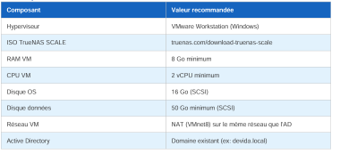

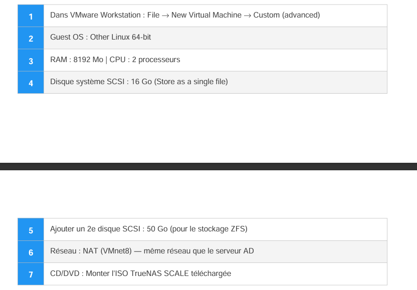

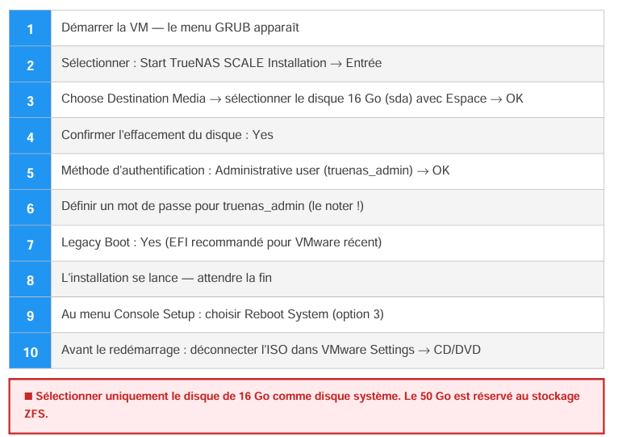

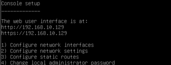

---

## 2. Installation du système

### Assistant d'installation

1. Démarrer sur l'ISO TrueNAS
2. Écran d'accueil → sélectionner **Install/Upgrade**
3. Choisir le disque de **16 Go** comme destination
4. Définir le mot de passe administrateur
5. Activer **EFI : Yes**
6. Terminer l'installation → **Reboot System**

### Compte administrateur

| Champ | Valeur |
|---|---|
| Identifiant | `truenas_admin` |
| Mot de passe | `Serveur@)@@` |

> **Note :** `Serveur@)@@` correspond à `Serveur2022` saisi en azerty → qwerty.

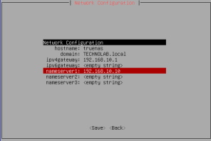

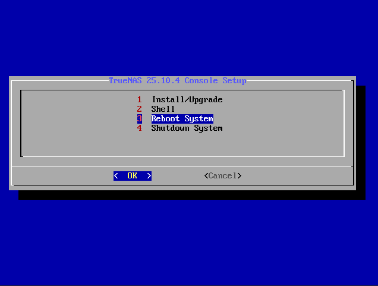

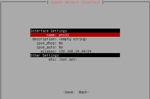

---

## 3. Configuration réseau

### Depuis la console

- **Option 1** → Configure network interfaces → `ens33` → DHCP: No → Alias: `192.168.10.40/24`
- **Option 2** → Configure network settings

| Paramètre | Valeur |
|---|---|
| Hostname | `truenas` |
| Domain | `TECHNOLAB.local` |
| Gateway | `192.168.10.1` |
| DNS | `192.168.10.10` |


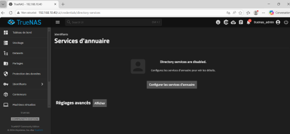

### Accès à l'interface web

Ouvrir un navigateur sur le poste Windows :

```
http://192.168.10.40
```


---

## 4. Synchronisation NTP

Kerberos exige une synchronisation horaire à **moins de 5 minutes** entre TrueNAS et l'AD.

```bash
# Shell TrueNAS (Option 8)
date -s "2026-06-05 10:26:00"

# Ou via chrony
echo "server 192.168.10.10 iburst prefer" >> /etc/chrony.conf
systemctl restart chronyd
```

---

## 5. Pool de stockage ZFS

### Création

1. Interface web → **Storage** → **Create Pool**
2. Nom : `datapool`
3. Cocher **Allow** pour disques non-uniques (VMware)
4. Layout : **Stripe** → Disque de 50 Go
5. Confirmer

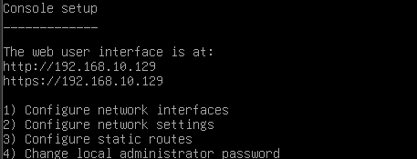

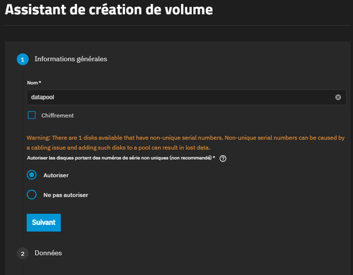

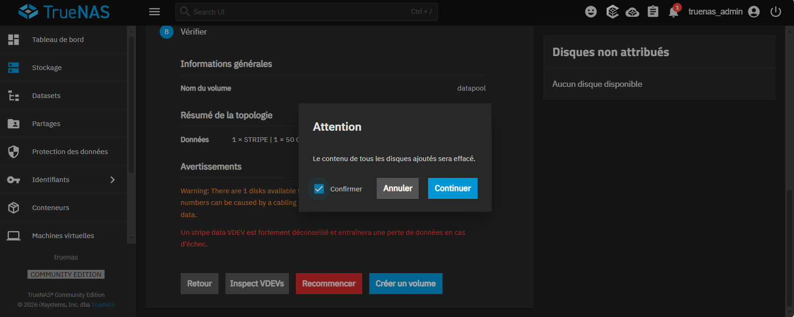

---

## 6. Enregistrement DNS

1. Serveur Windows → **Outils** → **DNS**
2. Zones de recherche directes → `technolab.local`
3. Clic droit → **Nouvel hôte (A)**
4. Nom : `truenas` — IP : `192.168.10.40`

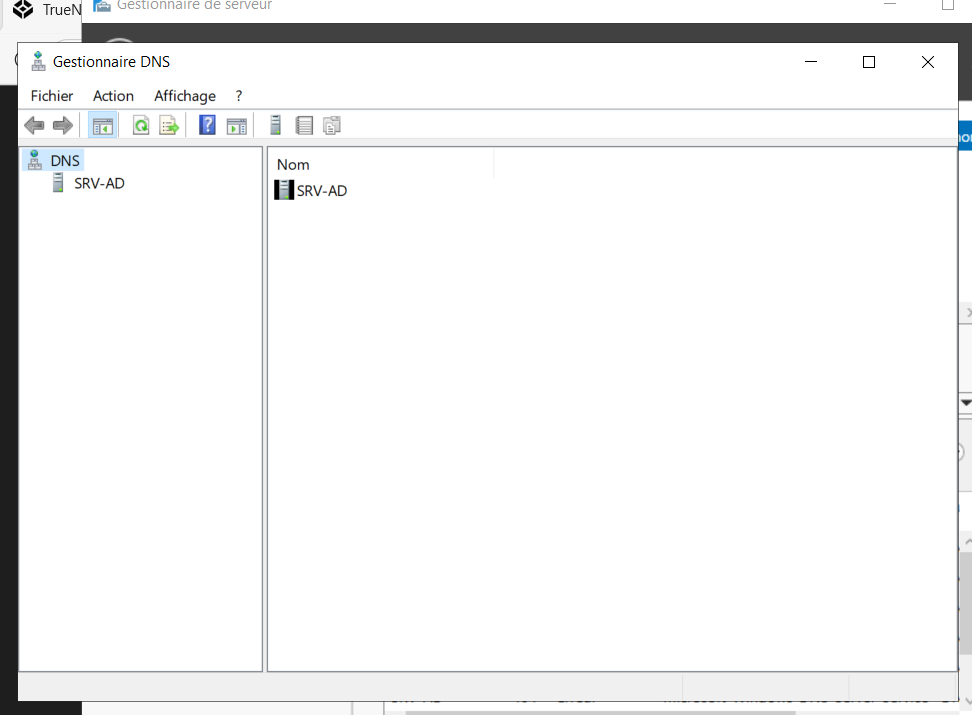

---

## 7. Jonction au domaine Active Directory

1. Interface web → **Identifiants** → **Services d'annuaire**
2. Mode : **Active Directory**
3. Paramètres :

| Champ | Valeur |
|---|---|
| Type d'identifiant | Kerberos User |
| Utilisateur | `Administrateur` |
| Mot de passe | `Serveur2022` |
| Domaine | `technolab.local` |

4. **Sauvegarder**


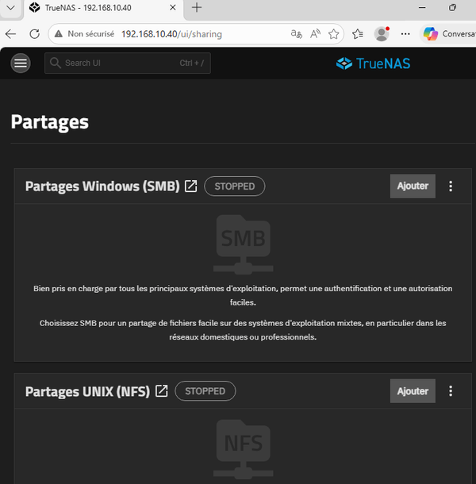

---

## 8. Partage SMB

### Création du dataset

1. **Storage** → `datapool` → **Create Dataset**
2. Nom : `partage`

### Création du partage

1. **Partages** → **Partages Windows (SMB)** → **Ajouter**

| Champ | Valeur |
|---|---|
| Chemin | `/mnt/datapool/partage` |
| Nom | `Partage` |
| Description | Partage commun technolab.local |

2. **Enregistrer**

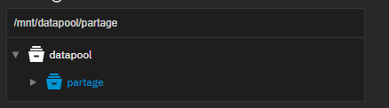

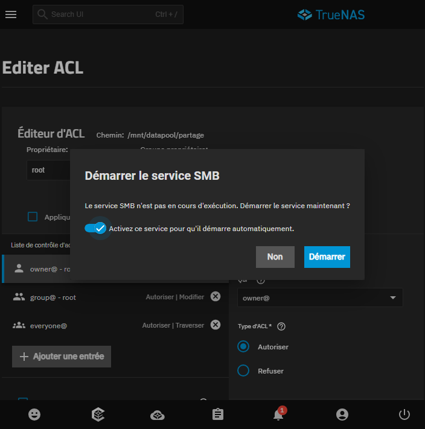

### Configuration des ACL

| Champ | Valeur |
|---|---|
| Qui | Groupe |
| Groupe | `DEVIDA\utilisateurs du domaine` |
| Type | Autoriser |
| Permissions | Modifier |
| Héritage | ✅ |

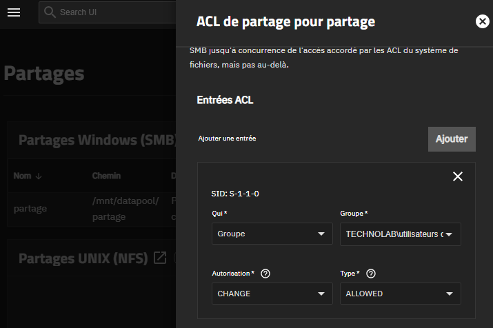

---

## 9. Mappage automatique via GPO

### Création de la GPO

```
Win+R → gpmc.msc → Entrée
```

1. Clic droit sur `technolab.local` → **Créer un objet GPO** → Nom : `Lecteur-TrueNAS`
2. **Modifier** → `Configuration utilisateur` → `Préférences` → `Paramètres Windows` → `Mappages de lecteurs`
3. **Nouveau** → **Lecteur mappé**

| Champ | Valeur |
|---|---|
| Action | Mettre à jour |
| Emplacement | `\\192.168.10.40\Partage` |
| Reconnecter | ✅ |
| Lettre | `Z:` |
| Libellé | Partage TrueNAS |

4. **Commun** → ✅ **Exécuter dans le contexte de sécurité de l'utilisateur connecté**

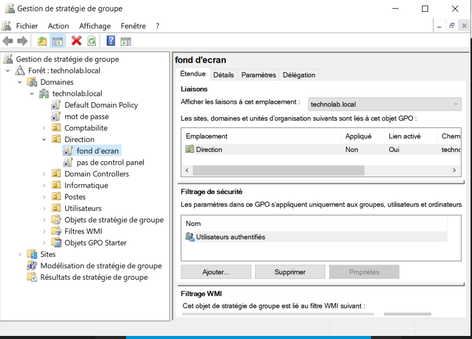

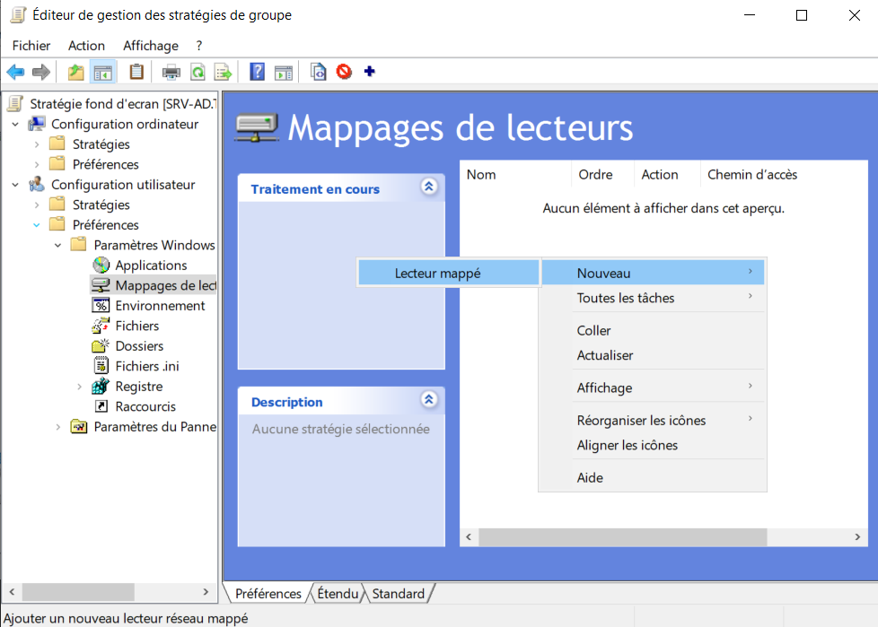

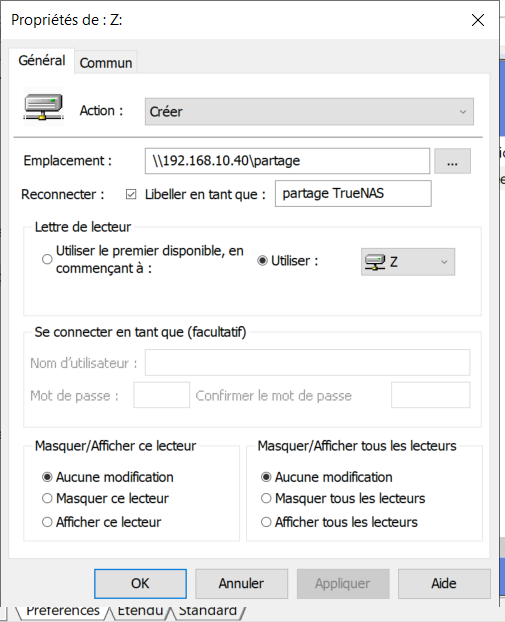

### Application

```batch
gpupdate /force
```

---

## 10. Problèmes rencontrés

### Problème 1 : Lecteur Z: non visible

**Cause :** La GPO s'exécutait avec le compte SYSTEM au lieu du compte utilisateur.

**Solution :** Cocher *Exécuter dans le contexte de sécurité de l'utilisateur connecté* dans l'onglet Commun de la GPO + passer l'Action en **Mettre à jour**.

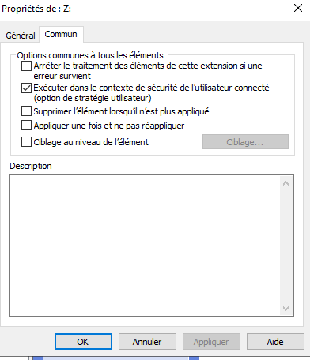

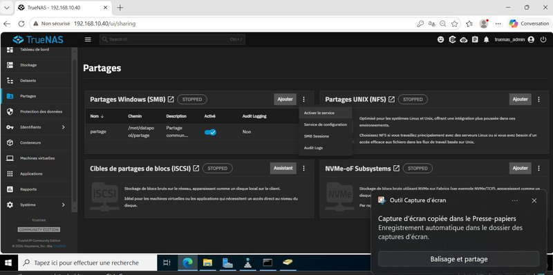

### Problème 2 : NAS visible mais inaccessible

**Solution :** Vérifier que le service **SMB** est actif dans l'interface web TrueNAS.

---

## 11. Conclusion

TrueNAS est opérationnel et intégré à l'infrastructure TechnoLab :

- Stockage ZFS fiable et performant
- Authentification via Active Directory
- Partage SMB accessible à tous les utilisateurs
- Lecteur réseau mappé automatiquement via GPO
